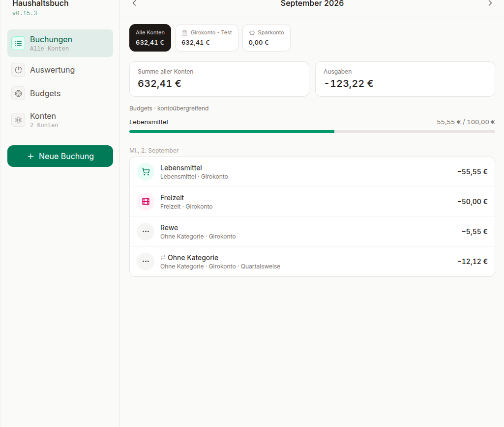
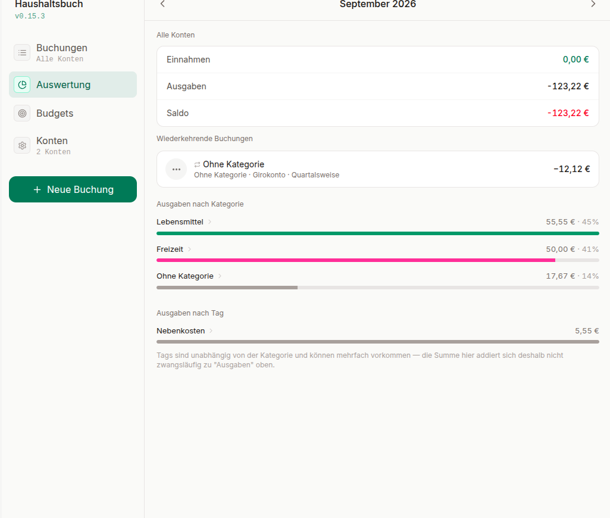
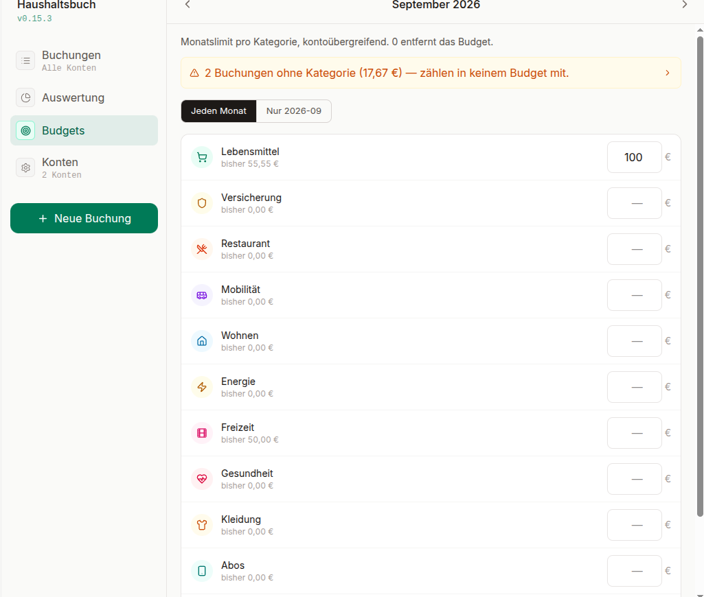
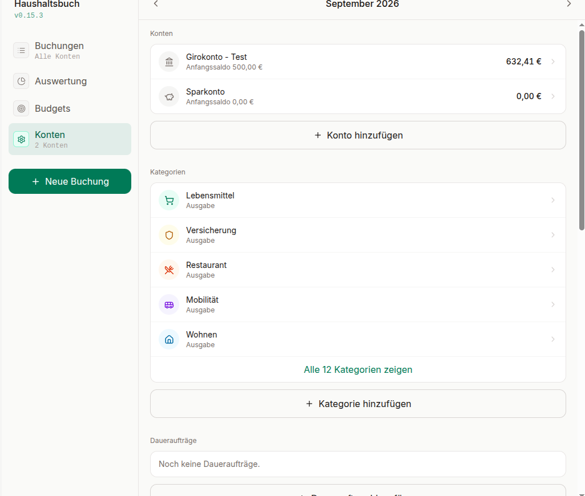

# Haushaltsbuch

Ein selbst gehostetes Haushaltsbuch für zu Hause. Ein Docker-Container,
kein Cloud-Abo, keine Werbung, keine dritte Partei sieht deine Kontodaten.
Läuft im Heimnetz, erreichbar von unterwegs per WireGuard.

Gebaut für den deutschen Alltag: CSV-Importe aus dem Online-Banking
funktionieren mit den üblichen Fallstricken deutscher Bank-Exporte out of
the box — Windows-1252-Kodierung, Komma als Dezimaltrennzeichen,
Vorspann-Zeilen, alles wird erkannt.

## Screenshots

| Buchungen | Auswertung |
|---|---|
|  |  |

| Budgets | Konten & Kategorien |
|---|---|
|  |  |

## Funktionen

- **CSV-Import für deutsche Bank-Exporte** — Kodierung, Trennzeichen,
  Datumsformat und Spaltenzuordnung werden automatisch erkannt. Vorschau vor
  dem Import, jeder Lauf ist vollständig rückgängig machbar.
- **Automatische Kategoriezuordnung** — Regeln nach Empfänger/Verwendungszweck,
  entstehen direkt beim Kategorisieren einer Import-Zeile statt vorab im
  Voraus geplant werden zu müssen.
- **Kategorien** — frei im UI verwaltbar, mit Icons und Farben.
- **Tags** — freie, mehrfache Zusatz-Kennzeichnung quer zur Kategorie (z. B.
  "Nebenkosten" auf einer als "Abos" kategorisierten Buchung).
- **Budgets pro Kategorie**, mit Warnhinweis für Buchungen ohne Kategorie —
  die sonst unsichtbar aus jeder Budgetrechnung herausfallen würden.
- **Auswertung** mit Drilldown: Kategorie oder Tag anklicken zeigt die
  zugrunde liegenden Buchungen, direkt bearbeitbar.
- **Daueraufträge** — erzeugen echte künftige Buchungen automatisch beim
  Öffnen der App, inklusive Kategorie und Tags. Kein Server-Cron nötig.
- **Umbuchungen als eine Buchung**, nicht zwei — Geld zwischen eigenen Konten
  verfälscht keine Auswertung.
- **Hell/Dunkel/System-Design**, responsive (Bottom-Nav auf dem Handy,
  Sidebar auf dem Desktop).

## Installation

Kurzfassung:

```bash
mkdir -p pb_data pb_public
docker compose up -d
```

Danach unter `http://<server-ip>:8090/_/` den Superuser anlegen und das
Schema erzeugen:

```bash
npm i pocketbase
PB_URL=http://<server-ip>:8090 \
PB_EMAIL=du@example.de \
PB_PASSWORD=... \
node setup/schema.mjs
```

Frontend bauen:

```bash
cd app
npm install
npm run build          # baut direkt nach ../pb_public
```

Die App ist danach unter `http://<server-ip>:8090` erreichbar. Für Details
zu Zugriffsmodell, Backups, Schema-Entscheidungen und Betrieb ohne HTTPS im
Heimnetz siehe [BETRIEB.md](BETRIEB.md).
